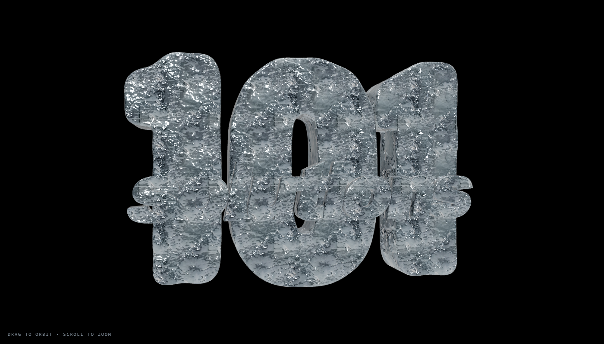

# 101 solutions — ice sign

The 3D wordmark from the 101 solutions site, as a self-contained web viewer:
the sign mesh, its film-ice material, and a page that renders it. Drag to
orbit, scroll to zoom.



## Run it

Any static server — ES modules will not load from `file://`:

```bash
python -m http.server 8000
```

Then open <http://localhost:8000>. three.js loads from a CDN, so the page
needs a network connection but no build step and no `npm install`.

## What is in here

| path | what it is |
|---|---|
| `model/s101-sign.glb` | the sign: two meshes — 3 numerals and 9 wordmark letters, 12 solids in total. Ambient occlusion is baked into `COLOR_0` |
| `textures/ice_*.png` | the ice maps: colour, normal, roughness, height |
| `index.html` | the viewer, ~120 lines, no dependencies of its own |

## The material

Ice does not read as ice from texture maps alone. What makes it convincing is
physical: light passes **through** the letters and is absorbed on the way, so
it comes out blue-cyan, at ice's refractive index. These are the values the
sign was built and measured with:

| property | value | why |
|---|---|---|
| `transmission` | 0.50 | ice transmits, but it also scatters — full transmission throws the albedo away |
| `thickness` | 0.42 | the letters are ~0.28 deep |
| `attenuationColor` | 0.62, 0.82, 0.92 | real ice absorbs red first |
| `attenuationDistance` | 0.35 | how far light gets before it is 1/e of itself |
| `ior` | 1.31 | ice, not glass (1.52) |
| `roughness` / `metalness` | 0.30 / 1.0 | roughness multiplies the map, which already runs 0.045–0.465 |
| `clearcoat` | 0 | film ice has a wet sheen, not lacquer |

Rendered through the AgX tone curve, which is what the original was graded on.

A physical material is lit only by what is around it, so the viewer supplies a
key, two fills and a room environment. With no lights at all the sign renders
essentially black — that is the material behaving correctly, not a bug.

## Notes

The mesh and the ice maps are 101 solutions' own assets. The viewer code is
here to show them.
